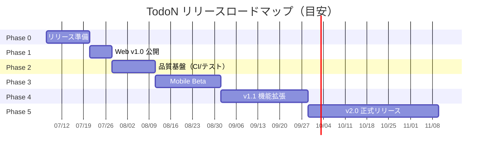

# TodoN — プロジェクト概要 & リリースロードマップ

## 1. プロジェクト概要

**TodoN（トドン）** は、個人とチームの両方に対応したタスク管理アプリです。  
「今日やること」に焦点を当てたダッシュボード、柔軟なリピートタスク、キャパシティ（気分・余力）に応じた表示調整など、**日常のタスク運用を軽く・楽しく** することを目指しています。

| 項目 | 内容 |
|------|------|
| リポジトリ名 | `todon` |
| 構成 | pnpm モノレポ |
| Web | Next.js 16（`apps/web`） |
| Mobile | Expo 54 / React Native（`apps/mobile`） |
| 共通ロジック | `@todon/shared`（`packages/shared`） |
| DB | PostgreSQL（Supabase + Prisma） |
| 認証 | Supabase Auth + レガシー JWT（bcrypt） |
| デプロイ | Vercel（Web） |

---

## 2. アーキテクチャ

```mermaid
graph TB
  subgraph clients [クライアント]
    Web[Web App<br/>Next.js 16]
    Mobile[Mobile App<br/>Expo 54]
  end

  subgraph shared [packages/shared]
    Types[型定義]
    ApiClient[TodoNApiClient]
    Logic[ビジネスロジック<br/>capacity / dashboard / flexible-repeat 等]
  end

  subgraph backend [apps/web]
    Pages[App Router ページ]
    API[API Routes /api/*]
    Server[Server モジュール]
    Prisma[Prisma ORM]
  end

  subgraph infra [インフラ]
    Supabase[(Supabase PostgreSQL)]
    SupabaseAuth[Supabase Auth]
    Vercel[Vercel]
  end

  Web --> API
  Mobile --> API
  Web --> shared
  Mobile --> shared
  API --> Server
  Server --> Prisma
  Prisma --> Supabase
  Web --> SupabaseAuth
  Vercel --> Web
```



### ディレクトリ構成

```
TodoN/
├── apps/
│   ├── web/          # Next.js Web アプリ（メイン）
│   └── mobile/       # Expo モバイルアプリ
├── packages/
│   └── shared/       # 型・API クライアント・共通ロジック
├── package.json      # ルートスクリプト
└── pnpm-workspace.yaml
```

---

## 3. 主要機能（現状）

### 3.1 Web アプリ（フル機能）

| カテゴリ | 機能 |
|----------|------|
| **認証** | 登録 / ログイン / ログアウト（Supabase + JWT フォールバック） |
| **ダッシュボード** | 本日の進捗バー、時刻表示、キャパシティ選択、期限切れ・今日・近日・進行中タスクのパネル |
| **タスク** | CRUD、ステータス、期日タイプ（なし / 日時 / いつでも / だいたい）、リピート（固定 / 柔軟）、重要度・緊急度・重さ、カテゴリ・プロジェクト紐付け |
| **サブタスク** | 追加・完了・削除、サブタスク提案（ルールベース） |
| **コラボ** | コメント、アクティビティログ |
| **スコープ** | 個人 ↔ チーム切り替え |
| **チーム** | 作成、招待、メンバー管理（owner / admin / member）、並び替え、チームタスク |
| **プロジェクト** | 個人・チームスコープ対応 |
| **テンプレート** | タスク雛形の保存・再利用 |
| **習慣** | 週次目標・ログ記録 |
| **カレンダー** | 月間ビュー |
| **ガント** | プロジェクトタイムライン |
| **アーカイブ** | 完了・非アクティブタスクの保管 |
| **週次振り返り** | 統計集計 + ルールベースのインサイト・提案 |
| **設定** | 通知 ON/OFF、Slack / Discord Webhook、Google カレンダー（ICS エクスポート） |
| **連携** | Slack / Discord 完了通知、ICS カレンダー購読 |

### 3.2 モバイルアプリ（部分実装）

| 実装済み | 未実装（Web のみ） |
|----------|-------------------|
| ログイン / 登録 | カレンダー |
| ダッシュボード | ガント |
| タスク一覧 / 作成 / 詳細 | プロジェクト |
| チーム一覧 / 作成 / 詳細 | 習慣 |
| 招待参加 | テンプレート |
| | 週次振り返り |
| | 設定 |
| | アーカイブ |

### 3.3 共通パッケージ（`@todon/shared`）

- 型定義（Task, Team, DashboardPayload 等）
- `TodoNApiClient`（Web / Mobile 共通 API クライアント）
- キャパシティ管理
- ダッシュボード提案（ルールベース）
- 柔軟リピートロジック
- タスク重さ推定・カテゴリ分類・サブタスク提案
- 本日進捗計算

---

## 4. 技術スタック

| レイヤー | 技術 |
|----------|------|
| Web フレームワーク | Next.js 16.2.6（App Router） |
| UI | React 19, Tailwind CSS 4 |
| Mobile | Expo 54, React Navigation 7 |
| ORM | Prisma 6.8 |
| DB | PostgreSQL（Supabase） |
| 認証 | Supabase SSR + bcrypt JWT |
| バリデーション | Zod |
| パッケージ管理 | pnpm 10 |
| リンター | ESLint 9 + 共有設定 |
| デプロイ | Vercel（`vercel.json` 設定済み） |

---

## 5. 現状の完成度と課題

### 5.1 強み

- Web 側は **v2 相当の機能が一通り揃っている**（個人 + チーム + 拡張機能）
- モノレポで型・API・ロジックを共有しており、Mobile 拡張の基盤がある
- Supabase 移行・Vercel デプロイ設定が進んでいる
- 独自 UI（ポップで親しみやすいデザイン）が確立されている

### 5.2 課題・未着手

| 領域 | 内容 |
|------|------|
| **テスト** | ユニット / E2E テストなし |
| **CI/CD** | GitHub Actions 等のパイプラインなし |
| **ドキュメント** | ルート README 未整備（Web は create-next-app デフォルト） |
| **環境変数** | `.env.example` なし |
| **認証** | Supabase Auth と JWT の二重体系（移行途中） |
| **Google 連携** | OAuth 未実装（ICS エクスポートのみ） |
| **Mobile** | 本番 API URL 未設定（`127.0.0.1:3000`）、機能カバレッジ約 40% |
| **監視** | エラー追跡・ログ基盤なし |
| **法務** | プライバシーポリシー / 利用規約なし |

---

## 6. リリースロードマップ

### Phase 0 — リリース準備（〜2週間）

**目標:** Web v1.0 を本番デプロイ可能な状態にする

| # | タスク | 優先度 |
|---|--------|--------|
| 0.1 | 本番 Supabase プロジェクト設定、マイグレーション適用（`db:migrate:deploy`） | 必須 |
| 0.2 | Vercel 環境変数の整備（`SUPABASE_*`, `JWT_SECRET` 等） | 必須 |
| 0.3 | 認証フローの一本化（Supabase を主、JWT フォールバックの整理） | 必須 |
| 0.4 | `.env.example` とルート README 作成 | 高 |
| 0.5 | 主要フローの手動 QA（登録→タスク作成→完了→チーム招待） | 必須 |
| 0.6 | エラーハンドリング・404 / 500 ページ整備 | 高 |
| 0.7 | `/api/health` の本番監視連携 | 中 |

**成果物:** Web v1.0 本番 URL で動作

---

### Phase 1 — Web v1.0 公開（〜1週間）

**目標:** 限定公開 or 一般公開

| # | タスク | 優先度 |
|---|--------|--------|
| 1.1 | プライバシーポリシー・利用規約ページ | 必須（公開時） |
| 1.2 | ランディング / オンボーディング改善（`/` → `/dashboard` の体験） | 高 |
| 1.3 | チーム招待メール（現状トークン URL のみ → メール送信） | 中 |
| 1.4 | Sentry 等のエラー監視導入 | 高 |
| 1.5 | パフォーマンス確認（Lighthouse, DB クエリ） | 中 |
| 1.6 | セキュリティレビュー（認可チェック、Webhook URL バリデーション） | 高 |

**成果物:** **Web v1.0 リリース**

---

### Phase 2 — 品質基盤（〜2週間）

**目標:** 継続開発の土台を固める

| # | タスク | 優先度 |
|---|--------|--------|
| 2.1 | GitHub Actions（lint / format:check / build） | 高 |
| 2.2 | 共有パッケージのユニットテスト（capacity, flexible-repeat, dashboard-suggestions） | 高 |
| 2.3 | API ルートの統合テスト（主要 CRUD） | 中 |
| 2.4 | Prisma マイグレーション CI チェック | 中 |

**成果物:** CI パイプライン稼働、回帰防止

---

### Phase 3 — Mobile v1.0 Beta（〜3週間）

**目標:** iOS / Android でコア機能を利用可能に

| # | タスク | 優先度 |
|---|--------|--------|
| 3.1 | 本番 API URL 設定（EAS / app.config） | 必須 |
| 3.2 | EAS Build セットアップ | 必須 |
| 3.3 | タスク詳細の機能拡充（サブタスク、ステータス変更） | 高 |
| 3.4 | スコープ切替（個人 / チーム） | 高 |
| 3.5 | 設定画面（最低限：ログアウト、API 接続確認） | 中 |
| 3.6 | TestFlight / Internal Testing 配布 | 高 |

**成果物:** **Mobile v1.0 Beta**（TestFlight / Play Console 内部テスト）

---

### Phase 4 — v1.1 機能拡張（〜4週間）

**目標:** 差別化機能の強化

| # | タスク | 優先度 |
|---|--------|--------|
| 4.1 | Google Calendar OAuth 連携（双方向同期） | 中 |
| 4.2 | プッシュ通知（期限当日リマインダー） | 高 |
| 4.3 | Mobile：習慣・プロジェクト・カレンダー | 中 |
| 4.4 | 週次振り返りの UI 改善（グラフ、トレンド） | 中 |
| 4.5 | チーム招待メール自動送信 | 中 |

**成果物:** Web v1.1 + Mobile 機能拡張

---

### Phase 5 — v2.0 本格リリース（〜6週間）

**目標:** Mobile ストア公開、Web / Mobile 機能パリティ

| # | タスク | 優先度 |
|---|--------|--------|
| 5.1 | Mobile 全画面実装（Web 機能パリティ） | 高 |
| 5.2 | App Store / Google Play 審査対応 | 必須 |
| 5.3 | E2E テスト（Playwright + Detox） | 中 |
| 5.4 | オフライン対応（Mobile ローカルキャッシュ） | 低 |
| 5.5 | 多言語対応（i18n）検討 | 低 |

**成果物:** **TodoN v2.0 — Web + Mobile 正式リリース**

---

## 7. マイルストーン一覧



| マイルストーン | 目標時期（目安） | 内容 |
|----------------|------------------|------|
| **Web v1.0** | 2026年7月中旬 | 本番デプロイ、コア機能安定 |
| **CI 整備** | 2026年7月下旬 | lint / build / 基本テスト |
| **Mobile Beta** | 2026年8月中旬 | TestFlight 配布 |
| **v1.1** | 2026年9月 | 通知・Google 連携 |
| **v2.0** | 2026年10月 | ストア公開 |

---

## 8. 必要な環境変数（参考）

Web アプリ（`apps/web/.env`）で想定される主要変数:

| 変数 | 用途 |
|------|------|
| `SUPABASE_DATABASE_URL` | Prisma 接続（プーラー） |
| `SUPABASE_DIRECT_URL` | Prisma マイグレーション |
| `NEXT_PUBLIC_SUPABASE_URL` | Supabase クライアント |
| `NEXT_PUBLIC_SUPABASE_PUBLISHABLE_KEY` | Supabase 公開キー |
| `JWT_SECRET` | レガシー JWT 署名 |

---

## 9. まとめ

TodoN は **個人 + チームのタスク管理** を軸に、キャパシティ連動ダッシュボード・柔軟リピート・週次振り返りなど独自機能を備えたプロダクトです。Web 側は機能的に v1 リリースに近い状態ですが、**テスト・CI・ドキュメント・認証整理** がリリース前の主要ボトルネックです。Mobile はコアフローが動作する段階で、Web との機能差が大きいため、**Web 先行公開 → Mobile Beta → パリティ達成** の段階的リリースが現実的です。
